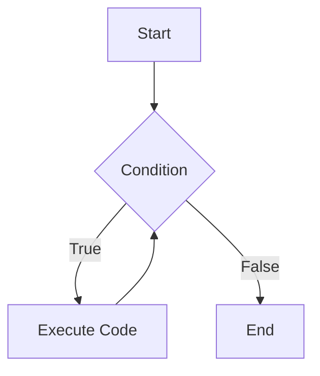
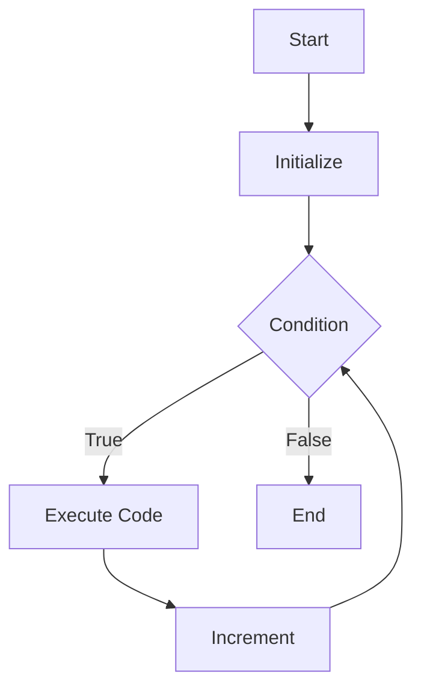

# Solutions to Exercise 4.2 (Compare while and for)

## Syntax

### While

-   The `while` statement's header **MUST** contain only the **loop continuation condition**.

```cpp
while (loopContinuationCondition)
{
    // statements
}
```

### For

-   The `for` statement's header can **Optionally** contain the **control variable**, **initial value**, **loop continuation condition**, and **increment**.

```cpp
for (initialization; loopContinuationCondition; increment)
{
    // statements
}
```

## Usage

### While

-   The `while` loop can be used to implement any kind of iterations, but for known counter controlled iterations, the `for` loop is more concise and easier to read.
-   Popular usage of `while` loop is when the number of iterations is not known in advance, or with sentinel-controlled loops.

### For

-   The `for` loop can be used as the `while` loop by omitting the control variable, initial value, and increment, but then `for` loop is less readable.
-   Popular usage of `for` loop is when the number of iterations is known in advance.

## Structure

### While



### For



---

-   [Next: Exercise 4.3](04_03.md)
-   [Back: to Chapter 4](README.md)
