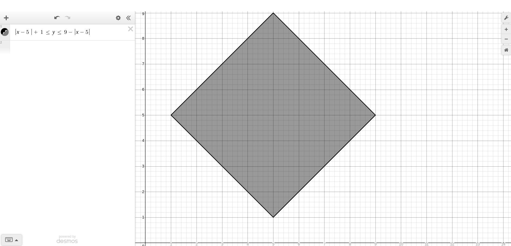

# Solutions to Exercise 4.19 (Diamond-Printing Program)

## Explanation:

-   Used desmos to plot the diamond shape, and get the equation for the diamond shape.
-   The diamond shape is plotted using the equation $ |x - 5| + 1 <= y <= 9 - |x - 5|$.
    
-   [C++ Code File](e04_19.cpp)

---

-   [Next: Exercise 4.20](04_20.md)
-   [Back: to Chapter 4](README.md)
